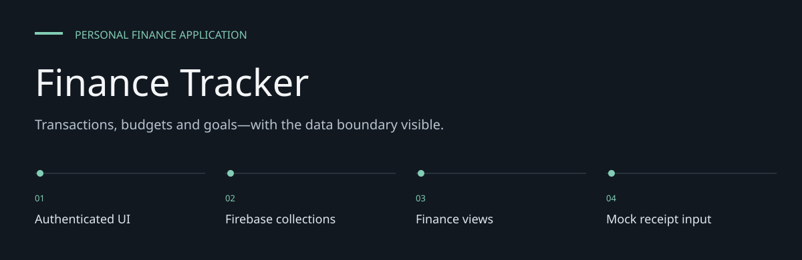
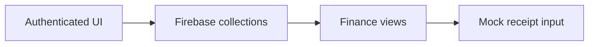

# Finance Tracker

**Transactions, budgets and goals—with the data boundary visible.**

A React / TypeScript personal-finance interface with Firebase-backed authentication and
collections for transactions, categories, budgets and goals.
The current build uses Vite; the previous Create React App starter README did not match it.


[Architecture](docs/ARCHITECTURE.md) · [Evaluation guide](docs/EVALUATION.md)

**Contents:** [The challenge](#the-challenge) · [Walkthrough](#walk-through-the-project) ·
[Implementation](#implementation-state) · [Design choices](#engineering-choices) ·
[Next evidence](#next-evidence-to-collect)

---

## The challenge

Personal finance becomes useful when transactions, budgets, goals and reports use a consistent
record of activity. This application assembles those views around Firebase services, with
additional receipt, voice and sharing interfaces at different levels of completion.

## System at a glance



## Walk through the project

### 1. Authenticate

Use the authentication UI against your own Firebase project. Protected client routes are UI
behavior; server rules must enforce data authorization.

### 2. Record activity

Create and inspect transactions and categories. The Firebase service owns collection operations
used by the interface.

### 3. Compare plans and reports

Open dashboard, budget, goal and report views. Check how the same entered data flows into each
display.

### 4. Inspect optional inputs

Receipt analysis returns mock data in the current service. Treat that path as a demonstration and
verify voice/sharing behavior separately.

## Product flow

Authenticate, record transactions, inspect dashboard summaries, set budgets and goals,
and review reports. Additional UI includes recurring transactions, receipt scanning,
voice input, settings and couple-sharing services.

Receipt analysis and category suggestions in `geminiService.ts` currently return mock data.
They do not constitute a completed Gemini receipt extraction integration.

## Local setup

```bash
git clone https://github.com/DanushArun/finance-tracking-app.git
cd finance-tracking-app
npm ci
npm run dev
```

Configure your own Firebase project through these Vite environment variables:

```text
VITE_FIREBASE_API_KEY
VITE_FIREBASE_AUTH_DOMAIN
VITE_FIREBASE_PROJECT_ID
VITE_FIREBASE_STORAGE_BUCKET
VITE_FIREBASE_MESSAGING_SENDER_ID
VITE_FIREBASE_APP_ID
```

Enable the Firebase services required by the app and configure authorization rules in your
own project. No backend access policy is proven merely by hiding a route in the React UI.
The mock AI service still references `process.env.REACT_APP_GEMINI_API_KEY`, a legacy convention
that needs reconciliation with Vite before claiming that integration works.

## Source map

- [App.tsx](src/App.tsx): authenticated routing.
- [firebaseService.ts](src/services/firebaseService.ts): auth and data services.
- [geminiService.ts](src/services/geminiService.ts): mocked receipt/category behavior.
- [components](src/components): dashboard, transaction, budget, goal and report UI.

## Verification

```bash
npm run lint
npm run build
npm run preview
```

Source, route structure and package scripts were inspected. The manifest has no test script.
No Firebase write, receipt-provider call or end-to-end finance workflow was executed for this
README update. Financial summaries depend on entered data and implemented calculations;
this repository does not demonstrate bank synchronization or audited accounting results.

## Engineering choices

**Vite is the current build.** Commands and environment names follow the actual manifest, not old
CRA boilerplate.

**Firebase services are explicit.** Authentication, data and storage depend on a separately
configured project.

**Mock AI is labeled.** Returned sample receipt data does not prove model extraction works.

## Implementation state

| State | Current evidence |
| --- | --- |
| Present | Finance UI and Firebase service source |
| Present | Budget, goal, transaction and reporting views |
| Mocked | Receipt extraction and category AI service |
| Not verified | Authorization rules, bank sync or accounting accuracy |

The [architecture guide](docs/ARCHITECTURE.md) maps these statements to source entry points.
The [evaluation guide](docs/EVALUATION.md) separates inspection, executable checks and
domain validation, with the next evidence needed for each project.

## Next evidence to collect

- Verify data authorization with separate test users.
- Reconcile legacy AI environment handling with Vite.
- Test reports against known synthetic transaction totals.
