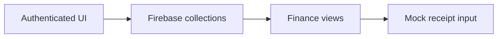

# Finance Tracker — Architecture and implementation

This guide follows the tracked implementation. Proposed work is identified separately.

## The problem and the system boundary

Personal finance becomes useful when transactions, budgets, goals and reports use a consistent
record of activity. This application assembles those views around Firebase services, with
additional receipt, voice and sharing interfaces at different levels of completion.

## Processing path

## End-to-end behavior

### 1. Authenticate

Use the authentication UI against your own Firebase project. Protected client routes are UI
behavior; server rules must enforce data authorization.

### 2. Record activity

Create and inspect transactions and categories. The Firebase service owns collection operations
used by the interface.

### 3. Compare plans and reports

Open dashboard, budget, goal and report views. Check how the same entered data flows into each
display.

### 4. Inspect optional inputs

Receipt analysis returns mock data in the current service. Treat that path as a demonstration and
verify voice/sharing behavior separately.

## Design choices and consequences

### Vite is the current build

Commands and environment names follow the actual manifest, not old CRA boilerplate.

### Firebase services are explicit

Authentication, data and storage depend on a separately configured project.

### Mock AI is labeled

Returned sample receipt data does not prove model extraction works.

## Source entry points

### [src/App.tsx](../src/App.tsx)

This file is part of the reviewed path described above. Follow its imports and calls
for the exact interface rather than inferring behavior from the filename.

### [src/contexts/AuthContext.tsx](../src/contexts/AuthContext.tsx)

This file is part of the reviewed path described above. Follow its imports and calls
for the exact interface rather than inferring behavior from the filename.

### [src/services/firebaseService.ts](../src/services/firebaseService.ts)

This file is part of the reviewed path described above. Follow its imports and calls
for the exact interface rather than inferring behavior from the filename.

### [src/services/geminiService.ts](../src/services/geminiService.ts)

This file is part of the reviewed path described above. Follow its imports and calls
for the exact interface rather than inferring behavior from the filename.

### [src/hooks/useTransactions.ts](../src/hooks/useTransactions.ts)

This file is part of the reviewed path described above. Follow its imports and calls
for the exact interface rather than inferring behavior from the filename.

## Implementation state

| State | Evidence boundary |
| --- | --- |
| Present | Finance UI and Firebase service source |
| Present | Budget, goal, transaction and reporting views |
| Mocked | Receipt extraction and category AI service |
| Not verified | Authorization rules, bank sync or accounting accuracy |

“Present” means tracked source or assets exist. It does not mean a production or domain
validation has passed. See [Evaluation](EVALUATION.md) for reproducible checks and limits.
